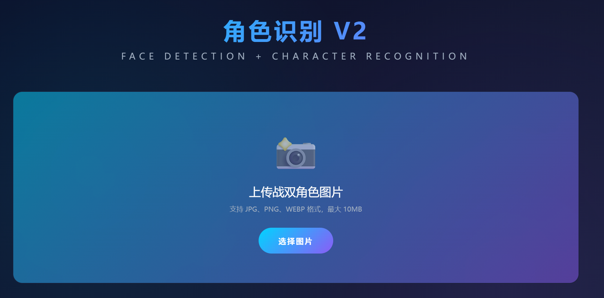
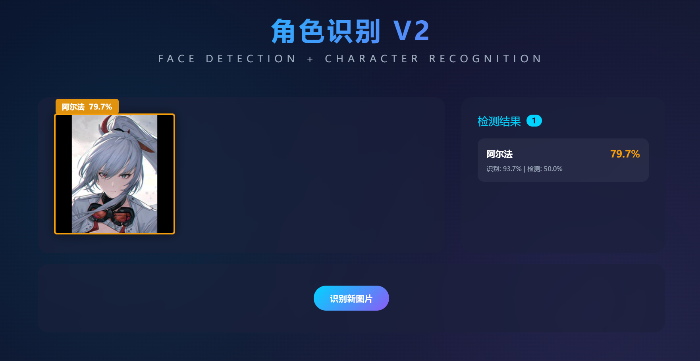
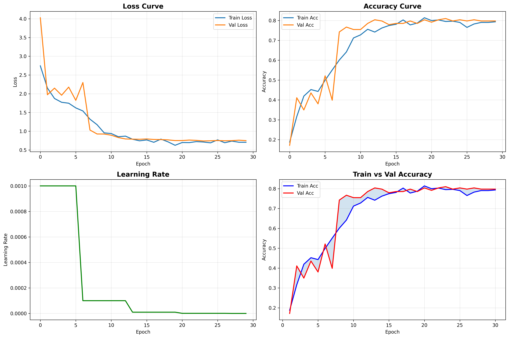

# 战双帕弥什角色识别系统

基于深度学习的战双帕弥什游戏角色识别Web应用，支持人脸检测和角色识别。


## ✨ 特性

- 🎯 **高准确率**：基于ResNet18的迁移学习，验证准确率达80.98%
- 👤 **人脸检测**：V2版本集成OpenCV人脸检测，提升复杂场景识别率
- 🖼️ **多角色支持**：可同时识别图片中的多个角色
- 🎨 **现代化UI**：科幻风格界面，流畅动画效果
- 📱 **响应式设计**：支持桌面和移动设备
- 🚀 **快速识别**：CPU模式下2-4秒完成识别

## 📸 效果展示

### 主页界面


### 识别结果（V2版本 - 人脸检测）


### 训练曲线


## 📊 支持的角色

系统可识别19个战双帕弥什角色：

21号、阿尔法、艾拉、比安卡、渡边、卡列尼娜、库洛姆、里、丽芙、露娜、罗塞塔、露西亚、诺安、七实、曲、赛琳娜、神威、万事、薇拉

## 🚀 快速开始

### 环境要求

- Python 3.7+
- PyTorch 2.0+
- OpenCV 4.0+
- Flask 3.0+

### 安装依赖

```bash
pip install -r requirements.txt
```

### 准备数据

1. 将角色图片放入 `战双人物图像_原始数据/` 文件夹
2. 运行数据处理脚本：

```bash
python process_and_augment.py
```

### 训练模型

```bash
# 准备训练数据集
python prepare_classification_dataset.py

# 开始训练
python train_classification_model.py
```

训练完成后，模型文件将保存在 `models/` 目录。

### 启动Web应用

**V2版本（推荐）**：
```bash
python recognition_app_v2.py
```

**V1版本**：
```bash
python recognition_app.py
```

然后在浏览器访问：http://127.0.0.1:5000

## 📖 使用指南

### V2版本（人脸检测 + 识别）

1. 打开Web应用
2. 上传角色图片（支持拖拽）
3. 点击"开始识别"
4. 查看检测结果：
   - 图片上显示检测框
   - 右侧列表显示识别结果
   - 点击框或列表项可高亮

### V1版本（直接识别）

1. 打开Web应用
2. 上传角色图片
3. 点击"开始识别"
4. 查看Top 5识别结果

## 🏗️ 项目结构

```
.
├── recognition_app_v2.py          # V2 Web应用（人脸检测+识别）
├── recognition_app.py             # V1 Web应用（直接识别）
├── train_classification_model.py # 模型训练脚本
├── process_and_augment.py         # 数据处理和增强
├── prepare_classification_dataset.py # 数据集准备
├── templates/                     # HTML模板
│   ├── character_recognition_v2.html
│   └── character_recognition.html
├── models/                        # 模型文件（需自行训练）
│   ├── best_model.pth
│   ├── class_names.json
│   └── model_info.json
├── docs/                          # 文档
│   ├── WEB_APP_GUIDE.md
│   ├── V2_UPGRADE_GUIDE.md
│   ├── DATASET_ANALYSIS.md
│   └── PROJECT_SUMMARY.md
└── requirements.txt               # Python依赖
```

## 📈 性能指标

### 模型性能

| 指标 | 数值 |
|------|------|
| 验证准确率 | 80.98% |
| 训练准确率 | 79.34% |
| 训练数据量 | 709张 |
| 角色数量 | 19个 |
| 模型架构 | ResNet18 |

### V1 vs V2

| 特性 | V1 | V2 |
|------|----|----|
| 整图识别 | ✅ | ✅ |
| 人脸检测 | ❌ | ✅ |
| 多角色支持 | ❌ | ✅ |
| 复杂背景 | 较差 | 优秀 |
| 识别速度 | 1-3秒 | 2-4秒 |

## 🔧 技术栈

- **深度学习**: PyTorch, torchvision
- **计算机视觉**: OpenCV
- **Web框架**: Flask
- **前端**: HTML5, CSS3, JavaScript
- **图像处理**: Pillow

## 📝 开发日志

### V2.0 (2026-02-17)
- ✅ 集成OpenCV人脸检测
- ✅ 支持多角色识别
- ✅ 可视化检测框
- ✅ 双重置信度显示

### V1.0 (2026-02-17)
- ✅ 基础角色识别功能
- ✅ ResNet18模型训练
- ✅ Web界面开发
- ✅ 数据增强处理

## 🤝 贡献

欢迎提交Issue和Pull Request！

## 📄 许可证

MIT License

## 🙏 致谢

- 战双帕弥什官方提供的角色素材
- PyTorch和OpenCV开源社区

## 📞 联系方式

如有问题或建议，请提交Issue。

---

**享受角色识别的乐趣！** 🎮
